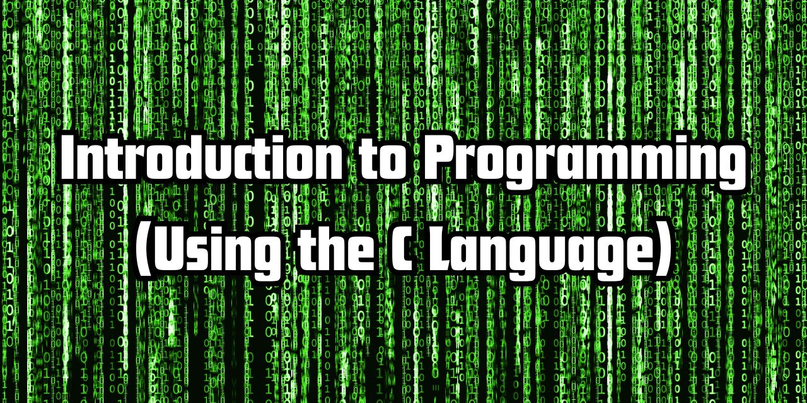

# Introduction to Computer Programming (Using the C Language)  
By [Brendan Gasparin](https://linktr.ee/brendangasparin)  

---

This repository is an introduction to programming using the C language.  

It is written in Markdown.  

## Table of Contents  

1. [Introduction to Programming (Using the C Language)](./manuscript/chapter-01/chapter-01.md)  
2. Setting Up A Software Development Environment  
3. Bits, Bytes, and Binary: Data Representation in Digital Computers  
