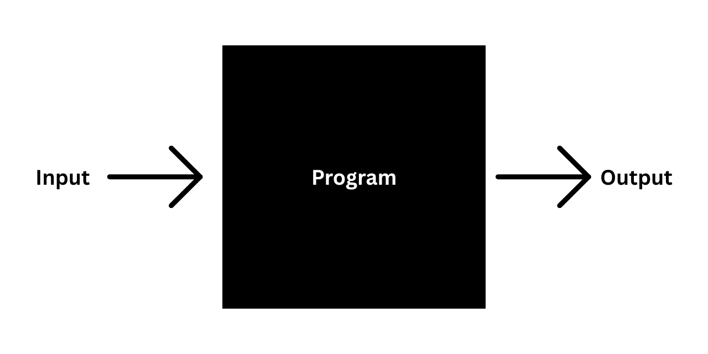
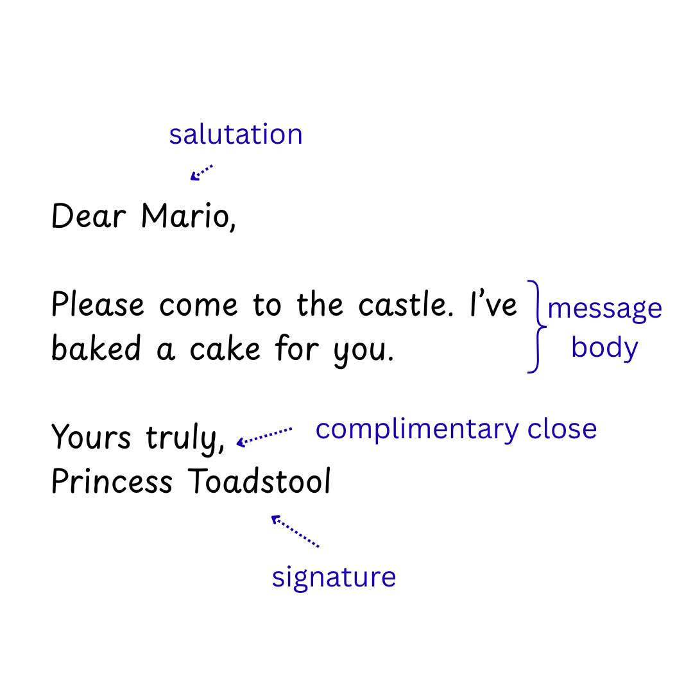
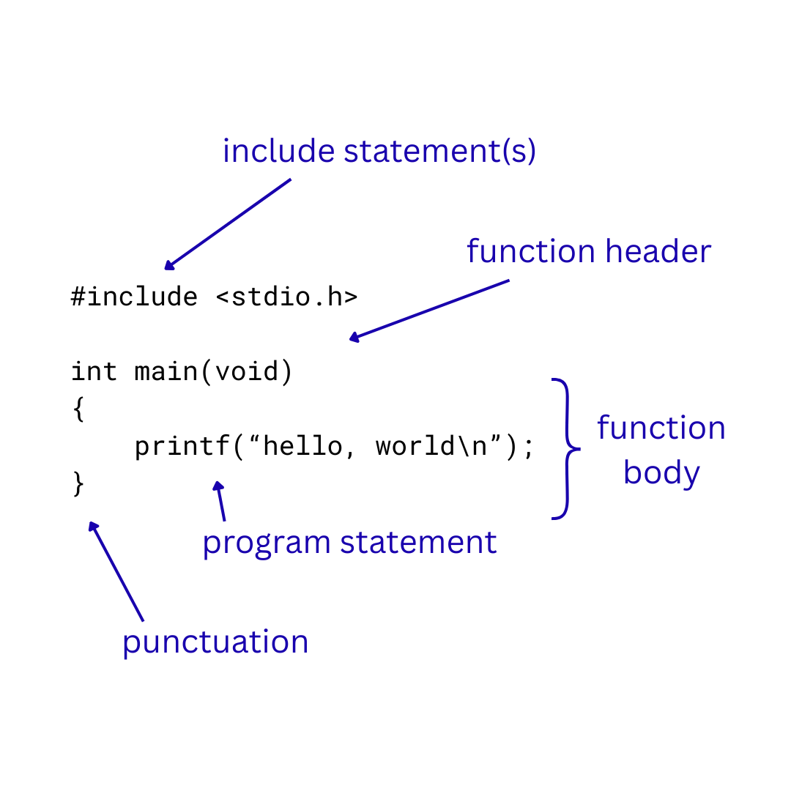

# 1. Introduction to Programming (Using the C Programming Language)  

Welcome to this introduction to programming using the C programming language!  

This book aims to teach you the art and science of writing computer programs.  

This will involve learning to think logically and creatively, solving problems systematically and efficiently, and writing code that is correct, efficient, and well-designed.  

We are going to learn to program using the C language, a relatively old computer language that still underlies the operations of most modern systems today.  

The C language is popular and relevant in the modern world and is ideal for teaching the low level fundamentals of programming that can be abstracted away by more modern languages.  

Are you ready to learn one of the most powerful skills you can master in the modern world? Let's go!  

## What is Computer Programming?  

A computer is anything that performs computations. Computations are mathematical or logical operations. This means that if you can count or make decisions based on logic, you are technically a computer. In fact, before the digital age, the term "computer" was generally used to refer to humans that were good at mathematics.  

Of course, nowadays, and for our purposes, a computer is assumed to be a digital device that can perform computations, like a desktop, a laptop, a smartphone, or even simpler devices like digital calculator and TV remote controls. If it has a microprocessor then it is a computer.  

A computer program is a set or sequence of instructions for a computer to perform. Programming is the act of writing a computer program, and one who does so is a programmer.  

In order to be useful in the real world, a computer (and most computer programs) must be able to accept input from the outside world for computation, and output the result of its computations in some way.  

This essentially makes a computer program a black box with input going in one end and output coming out the other.  

  
*Figure 1: Program with input and output.*  

Obfuscated inside the box is whatever algorithms, problem-solving processes, and computer instructions the programmer implemented when they wrote the program. These are applied to the input to give an output.  

For example, an electronic cash register might be programmed to sum the scanned items being purchased by a customer. If the program is correctly implemented then the user does not need to know the specifics of what is in the program's "black box".  

A computer game takes input from a player using controls, applies that input to the player's character in the game, and then outputs the result on the screen and speakers.  

A program is correct if it produces the expected and correct output for all inputs. Verifying this can often take extensive testing.  

Programming is a technical process, but can also be a creative one, like sculpting, painting, or making music.  

In formal science we test our hypotheses until they can be confirmed, refined, or discarded. But in computer science, and particularly programming, we begin with a problem, usually rooted in the real world, and design and build a technological solution for that problem. In this way, programming is more like the fine arts than the sciences.  

Computer programs do everything from simple mathematics to managing entire governments, corporations, militaries, and economies.  

Programs manage social infrastructure, city utility grids, launch rockets, and keep satellites in space. They also let you doomscroll social media on your phone, surf the web on your laptop, and watch streaming services on your smart TV.  

Programmers are the people who write and maintain all of the code required to keep the various moving parts of modern digital society interlocked and functioning.  

Computer programs are written in computer programming languages. These are also referred to as code (and programming as coding).  

## What is a Programming Language?  

A programming language specifies words and symbols that can be used for writing programs. It also defines rules for combining these words and symbols to form valid program statements.  

A computer language is much like a human language. Human languages also specify words, punctuation, and rules that can be used to form understandable sentences.  

A program can be thought of like a written language. A written language (like English) is also composed of words and punctuation, and the rules that combine these words and punctuation into phrases, sentences, and paragraphs that can be meaninfully interpreted by a human reader.

Take the example of a letter (or email).  

  
*Figure 2. An example of a letter or email.*  

A letter consists of sections, like the the salutation, the body, the complimentary close, and the signature. Each section is comprised of lines or paragraphs, which in turn consist of words and punctuation. There are various rules that can be used to create a grammatically correct and meaninful sentence. For instance, in English, a sentence ends in punctuation (a period, exclamation mark, or question mark). Commas are used to end the saltuation and separate the complimentary close from the signature. Names such as Mario and Princess Toadstool have their first letter captialised.  

Similarly, a program might be divided into sections: one or more functions, which are each comprised of one or more program statements, which are in turn each composed of words and symbols that follow rules to create code that translates into computer instructions.  

  
*Figure 3. A program with a function, statements, words, and symbols*  

This is an example of a simple C program. It has a single function which contains a single program statement. There is also an include statement, the function header, symbols like punctuation, and white space.  

Functions are named blocks of code. They consist of one or more programming statements. These programming statements determine what the function will do.  

Programming statements consist of words, symbols, and white space, just like an English sentence. The words and symbols have specific meanings or uses in the C language. For example, `printf` prints whatever follows it in the parentheses and double-quote marks.  

This program simply prints the message `hello, world` to the computer's ouput (e.g. the monitor).

Words and symbols in C represent things known as tokens. Tokens can be divided into:  

- Keywords  
- Identifiers  
- Constants  
- Operators  
- Punctuation  

Keywords are words that already have a defined meaning and a specific use or uses in the C language. They are reserved words, which means they cannot be used as identifiers.  

Identifiers are names given to things by programmers. Programmers might give names to functions, constants, variables, and more complex data structures like arrays.  

Constants are literal values, like the number 42, the character 'B', or the string "hello".  

Operators are mathematical, logical, (comparison?,) and assignment operators like + or -. They are used to store, retrieve, compare, and compute values.  

Punctuation is also used in C code. For example, a semi-colon indicates the end of a program statement. A set of curly parentheses indicate a singular block of code.  

Code can contain comments. These statements have no function and are not executed by the computer. They are used to leave messages and reminders to yourself or other programmers who look at your code.  

Code can also contain whitespace (spaces, tabs, and newlines). Different programming languages treat whitespace in different ways. C ignores it, but it can be used to drastically enhance readability for human users, and many institutions and organisations have specific style guides on how to write and space C code.  

As well as the words and symbols that comprise a language, programming languages have **syntax** and **semantic** rules, just like human written language.  

The **syntax** or **syntactical rules** of a human language define how words and symbols are combined to communicate meaning. The syntactical rules of a program define how to make valid program statements. Syntactical rules inclusw the correct sequencing of words and symbols, and the grammatical rules used to put them together.  

The **semantic** meaning of a statement is what a statement's meaning in a given language. In our example English letter, this is Princess Toadstool asking Mario to come to the castle for a cake. In a programming language, this equates to what a piece of code will do if executed.  

A syntax error is an error in the syntactical rules of a programming language. A program will only run in C if it follows the exact rules of the language.  

For example:  

```c
#include <stdio.h>

int main{void}
(
    printf("This program has started.\n");
    printf("This program has finished.\n");
)
```

This is a syntax error because we are using curly braces around the void keyword in the function header, and parentheses around the function's code block. It should be the other way around. We are not following the syntactical rules of the programming language so the program cannot be executed because the computer will not understand it as a valid C program.  

It is possible for a program to be syntactically correct but to have a semantic error. A semantic error is a logical error. The program will run but will not produce the intended output.  

```c
#include <stdio.h>

int main(void)
{
    printf("This program has finished.\n");
    printf("This program has started.\n");
}
```

It seems that the programmer got the program statements around the wrong way and now the program will claim to be finished before it even starts. This is a semantic error. The program is syntactically fine, but the final output will not be correct. It will not be what the programmer intended.  

Different programming languages have different capabilities and requirements, but general knowledge of one language and how to use it makes it much easier to learn other languages, especially similar ones.  

## Source Code, Compilers, Interpreters, and Software Applicatons  

Computers do not understand human languages like English. They do not really understand programming languages like C either. Computers are ultimately electronics that only understand electricity. But electricity can be expressed as binary values: on or off, electricity or no electricity, one or zero, true or false.  

You may have heard that computers only understand the mathematics of binary, a number system comprised entirely of zeroes and ones. This is true. Human-readable programming languages were written as an intermediary so that humans could read and write sensible commands for computers without having to write pure binary.  

Programmers tend to write in human-readable languages like C. Programs in these languages are called source code. They are usually stored in plain text files.  

Source code can be fed through programs called compilers and interpreters that convert the code into binary instructions for computers to execute.  

Some programming languages are interpreted. The source code for these programs is read by another program called an interpreter. The interpreter reads the source code and then executes the instructions on the fly. Examples of interpreted languages are JavaScript and Python.  

Other languages, like C, are compiled. The source code for C is written and saved by a programmer in a source code file. It is then read by a program called a compiler, which creates a separate executable file where the C code is translated into binary instructions for a computer. This executable file can then be executed as a software application.

There are three types of errors that a programmer can make when writing C code:

- **Compiler errors:** These are errors that prevents a program from compiling and producing a binary application. These are often syntax errors.  

- **Runtime errors:** If the program compiles but fails while executing, this is called a runtime error. Sometimes this can cause abnormal termination of a program (e.g. the program crashes).  

- **Logical errors:** If the program runs but produces the wrong output, then a logical error is usually the cause. These are semantic errors where the code is working but not doing what the programmer intended.  

A compiled program is often referred to as a software application. A software application is only part of a final software product, which can also consist of documentation, intangible components like data, and sometimes physical components like packaging or storage media.  

## The Flow of Program Development in C  

The flow of program development in C is an iterative process that repeats until the programmer has achieved what they set out to accomplish by writing the program.  

1. The programmer writes or edits the source code in a text editor to implement or correct a piece of functionality. When this functionality is ready to be tested, the programmer saves the program.  

2. Now the programmer compiles the program with a compiler. If the compiler fails to compile it will produce one or more syntax errors that may or may not contain helpful information on what went wrong and how to fix the program. At this point, the programmer must return to step 1 and fix any syntax errors.  

3. If the program successfully compiles then it can be executed, and the results can be tested. If unexpected results are produced for any input, then we have found runtime errors or logical errors and must return to step 1 to correct them.  

4. If our desired program is fully implemented and runs correctly then the process stops here. Otherwise, if we still have more functionality to implement, we return to step 1 to implement the next piece of functionality.  

## Why You Should Learn Programming  

1. Programming teaches you to think logically and systematically  
2. You can create or control nearly anything with software  
3. Unlock career and academic opportunities
4. Automate the boring (and difficult) stuff
5. Unlock career and academic opportunities

## Why Should You Learn C Programming As Your First Language?  

Why should you learn C programming as your first language?  

C instructions map extremely closely to the actual hardware functions of a computer, which we will learn in the next chapter. This means that by learning C you will also be learning the funamental way that computers work.  

C is an older language, but it underpins a lot of modern computer technology like Linux, macOS, and even Windows. A lot of applications are written in C, and some of the larger programming languages are built with C as a base. The syntax and keywords of many other languages are also similar to C, so if you learn C, you will have a foot up in learning other languages.  
