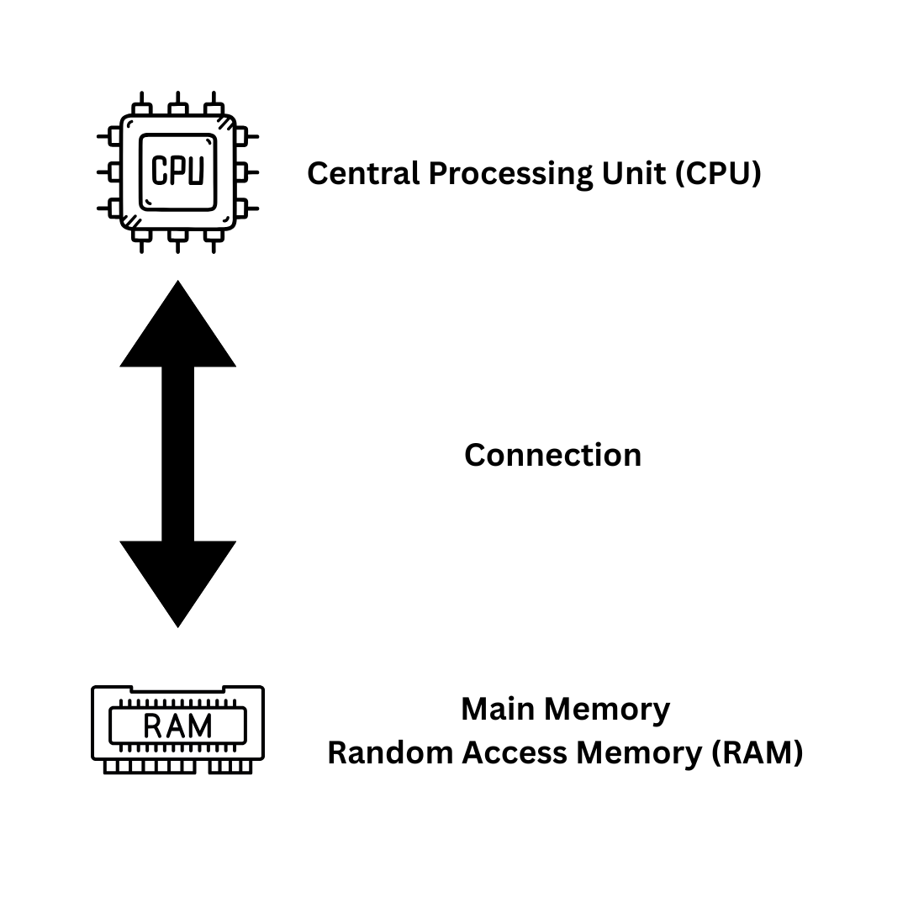
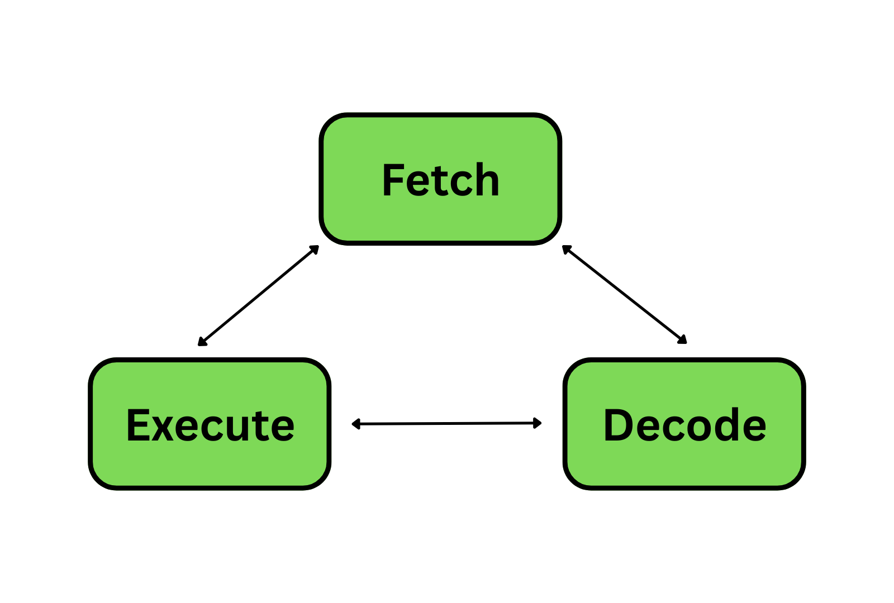
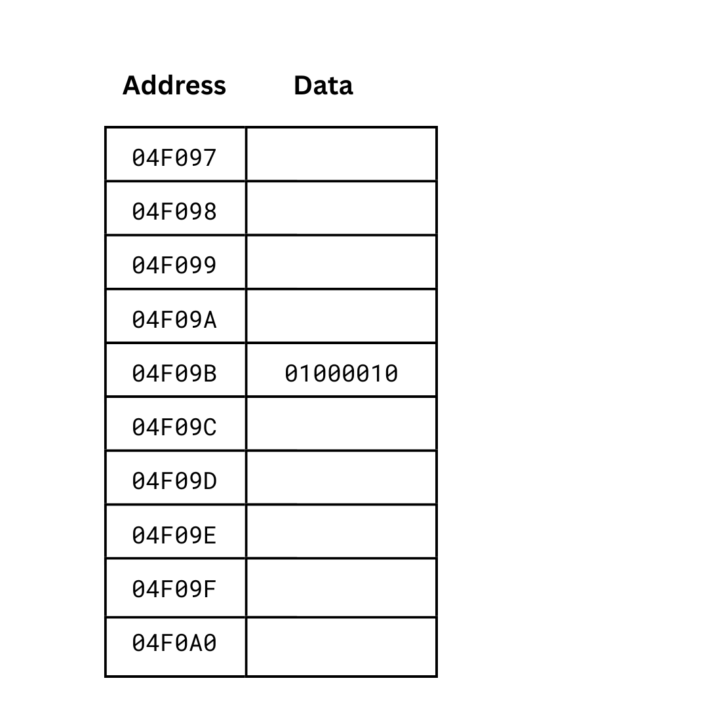

# 2. Computer Fundamentals: Hardware, Software, and Operating Systems  

To truly understand programming in the C language we need to understand the fundamentals of computing: hardware, software, and operating systems.  

## Hardware and Software  

A computer is comprised of hardware and software.  

Hardware is the physical, tangible components of a computer. This might include the case and any circuit boards, chips, wires, or other components and connections inside it, as well as external devices like keyboards and monitors. If you can physically touch it then it is hardware.  

Software is programs and data: information stored in some format.  

A program is a series of instructions, as we have discussed.

Data is the raw information that a program manipulates. Data in a computer is represented in binary numbers (zeroes and ones) which we will discuss in a future chapter, but binary numbers can also be used to represent human-readable numbers, text, images, sound, video, and anything else that mathematics can possibly represent.  

A computer requires both hardware and software to operate. The hardware can add one plus one, but only if software (i.e. a program) tells it to do so. Without software, a computer is just an inert bundle of physical components. Without hardware, software is just a series of instructions with nothing to execute them.  

## Hardware  
In order to be useful and perform mathematical operations on data, a modern computer needs the following hardware components:  

- Central processing unit (CPU)  
- Main memory
- Connections between components (particularly the CPU and main memory)
- Secondary memory  
- Input and output devices  
- Connections between components  

The two most important components are the central processing unit (CPU) and the main memory. The CPU retrieves data from the memory, performs operations on that data, and writes data back to the memory.  

There are many other components that can be incorporated into computers and controlled by computers, but first we will look more closely at the CPU and main memory.  

### Hardware: The Central Processing Unit (CPU)  
The component that executes program instructions is called a processor, or microprocessor. In a modern computer, this is a silicon chip. There are many different types of processors. Some are for general use, some specialise in arithmetic, and others specialise in graphical operations.  

Computers generally have one or more processors, but conceptually (and historically) a computer has a single central processing unit (also called a CPU) that executes program instructions.  

Processors can perform mathematical operations and make logical decisions.  

The CPU is continually running through the fetch-decode-execute cycle.

In this cycle it:  

1. Fetches the next programming instruction from main memory
2. Decodes the instruction from binary to determine the instruction
3. Executea the instruction, accessing and modifying data from the main memory if instructed to do so
4. Back to step 1 to fetch the next instruction

### Hardware: Main Memory  
The main memory of a computer is also called primary storage. This is an area to store programs and data that are being actively used. Main memory in modern computers are usually RAM, which stands for random access memory.  

In this way, the functionality of a computer is split in two. The main memory holds most of the data and program instructions that a program needs. The CPU requests data from main memory when needed, performs operations on it, and writes the results of those operations back to main memory.  

Main memory is made of memory locations, called cells. These cells each store a number of bits called a word. This is normally eight (8) bits (i.e. one byte). Values too large to be stored in a single word will be stored in consecutive (i.e. contiguous) cells.  

In the same way a house or apartment has a unique address, so does a memory location. This allows the CPU to find the memory address so values can be read or written to the memory. These addresses are unique numeric identifiers. Like other numbers, a computer expresses these internally as binary numbers, but they are sometimes also represented in hexadecimal, a number system consisting of sixteen digits (0 through 9 followed by A through F). We will look at hexadecimal in chapter 4.  

Main memory usually stores information as electricity in RAM chips. When a computer is powered off, the RAM loses electricity and forgets all of the information that was stored. Main memory is extremely fast, which is vital for a computer that has to perform a lot of operations, but it is also volatile: when a computer loses power, the main memory loses all of its stored information.  

If we want to retain information when a computer is powered off, we need another type of memory.  

### Hardware: Secondary Memory (or Secondary Storage)  

Secondary memory is long-term storage. It is not volatile, and the data it holds can survive losing power.  

There are many types of secondary memory: hard drives, USB drives, optical disks, and older technology like floppy disks, magnetic tape, and even punch cards.  

Modern computers have one or more types of internal secondary memory to hold things like the operating system, software applications, and data. This might be a hard drive in a PC or laptop, or ??? in a smartphone.  

When main memory requires information for the CPU to process, it reads the information from secondary memory. The processor can then read the data from main memory, perform operations on it, and write the results of those operations back to main memory. If these results need to be stored long term, they can then be written back to secondary memory, at which point they can be safely discarded from main memory.

### Hardware: Input and Output Devices  
As we discussed in chapter 1, for a computer to be useful there needs to be a way to input information into it, and a way for it to output information. This is what input and output devices are for.  

Input devices like a keyboard, mouse, or sensor can be used for humans to input information into a computer. Output devices like monitors and speakers can be used by the computer to display output.  

Some input and output devices are less obvious. A camera is an input device, as is a barcode scanner connected to a digital cash register. A printer is an output device, as are the "stop" and "go" lights at a traffic intersection.  

### Hardware: Connections  
The CPU must connect directly to the main memory for a computer to quickly read, write, and process data. There must also be a way for primary memory to write and read information to and from secondary memory.  

## Software

Software, as we have discussed, is executable programs. Software can be divided into two categories.  

The **operating system (OS)** controls the computer hardware and provides a user interface so that humans can run and interact with programs. It manages computer resources such the CPU, memory, and file system.  

An **application program** refers to any software that is not part of the operating system. In this book, we will be programming software applications.  

Software must have an **interface** to allow users to interact with it.  

A **command line interface (CLI)** is a text interface where users input information from a keyboard, and the software outputs information in text.  

A **graphical user interface (GUI)** allows the user to interact with software through graphical components, e.g. a mouse pointer, icons, menus, and buttons.  

### Software: Operating System (OS)

The operating system is special software that controls the computer hardware and provides a user interface to users so that they can run application programs.  

The operating system manages computer resources such as:  

- The central processing unit (CPU)  
- Main memory (RAM)  
- Files on secondary storage  
- Other devices such as input/output devices  
- Programs/processes (a running program is known as a process)  

The operating system also provides an interface to the computer hardware for software applications. This is what allows our programs to access the CPU, keyboard input, and other devices. Functionality like this, built into the operating system, allows application programmers to implement certain features (e.g. reading keyboard input) without having to reinvent the wheel every time they write a program.  

Conceptually, the operating system is a layer of software between a computer's hardware, other software applications, and users.  

Different operating systems used in the real world include the Windows family of operating systems, Linux-based operating systems, macOS, and smartphone operating systems like iOS and Android.  

### Software: Applications

Software applications are any program that is not part of an operating system. This might include text editors, compilers, web browsers, streaming apps, and video games.  

Note that some applications may come bundled with an operating system, like Notepad with Windows or the Messages app in iOS. This does not make them operating system programs, as they have nothing to do with managing hardware, resources, or providing access to users.  
