# Bits, Bytes, and Binary: Number Systems in Computer Science

Computers only understand electricity, which can be expressed as zeroes and ones: voltage or no voltage. All data in a computer is represented by zeroes and ones. In this chapter we will learn how zeroes and ones can be used to express human-readable decimal numbers, as well as other things like alphabetical characters, text strings, images, audio, and video.  

## Number Systems: Unary, Binary, and Decimal

There are many number systems for representing values in the world of mathematics. Humans tend to count using unary (base-1), and write numerals in decimal (base-10). Computers only know binary (base-2). So how do we represent decimal numbers and things like text programming statements in binary?  

We will take some time to explore different number systems so we can understand how data is represented in computers, and in the C programming language.  

### The Unary System (Base-1)

To understand binary, we will first look at the unary system.  

The unary system (also known as base-1) is the number system people use when they count on their hands, or tally with marks. It is the simplest way of representing numbers.  

Instead of using place values like decimal or binary, unary represents numbers by repeating a single symbol, e.g. fingers, or tally marks.  

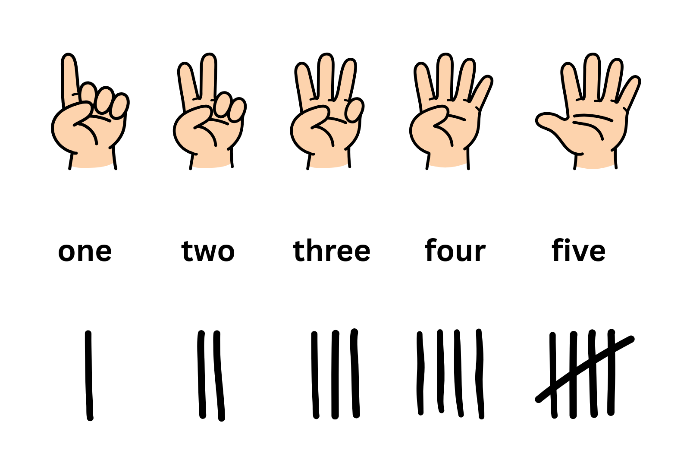

Each digit represents an increment in the value of the number. For example, one finger usually means one, two fingers means two, three fingers means three, etc.  

This is called base-1 because there is only one symbol used to represent numbers (i.e. a finger, tally mark, etc.).  

With the unary system, five symbols can be used to represent the number `5`. Twenty symbols would be needed to represent the number `20`. This is not very efficient.  

What if there was a better way to use symbols to represent numbers? For example, what if we weighted the value of a digit based on its position in a pattern of digits?  

### The Binary System (Base-2)

Binary (or base-2) is another number system: the number system used by computers. Binary is comprised of bits, which stands for binary digit. "Bi" implies two, and there are only two binary digits: zero and one.

In a computer, these are often represented by electricity, or an absence of electricity (e.g. in an electronic component or connection). So as well as representing zero and one, binary can be used to represent on versus off, true versus false, and other binary states.  

Multiple binary digits can be used to create a binary word. The number of binary digits used to represent a number is called a word. For example, five binary digits is a 5-bit word.  

Binary is a **positional** number system, which means that the position of a bit in a pattern of bits affects it final value.  

Let's look at a binary word of 5 bits, similar conceptually to a human hand, and see how many values we can represent with only five binary symbols.  

The number zero can be represented with all zeroes.  

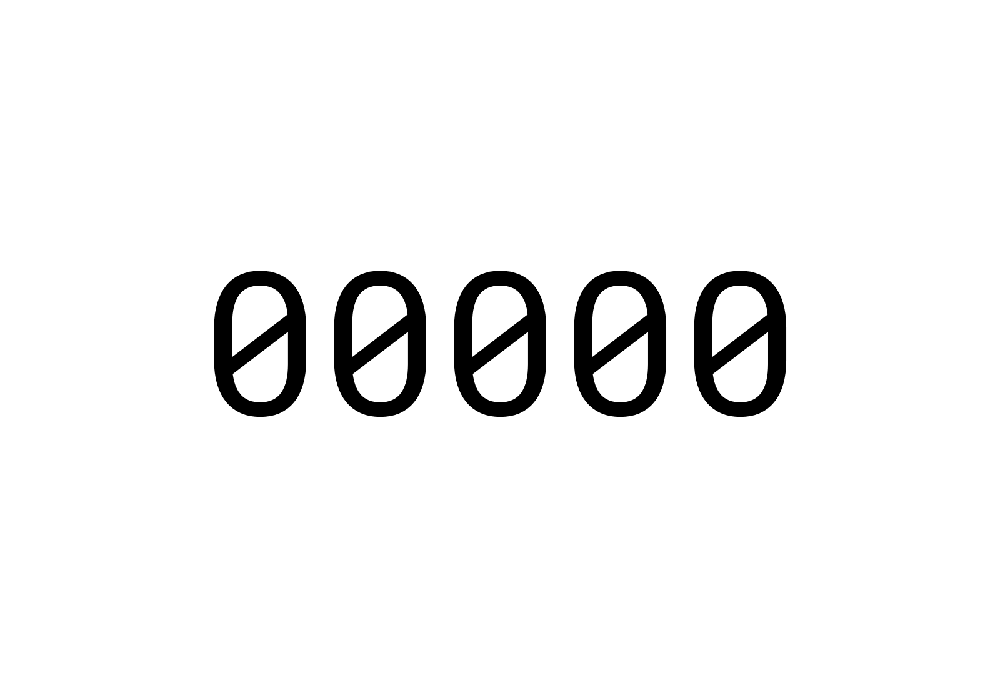

If a bit in a binary number is zero, then its value is zero, regardless of its place in the overall number. So `00000` has a value of `0`.  

The rightmost digit in a binary number (which we call the first digit) has a **place value** of `1`. If this bit is set to `1`, then we add the place value of the digit to the final value of the binary number. So, in a 5-bit binary word, the number `1` is represented as `00001`.  

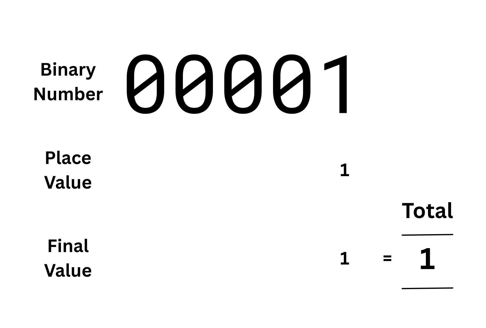

The second digit from the right has a **place value** of `2`. Therefore, to represent the value `2` in an 8-bit binary word, we set all the other digits to zero, and the second digit (from the right) to one.  

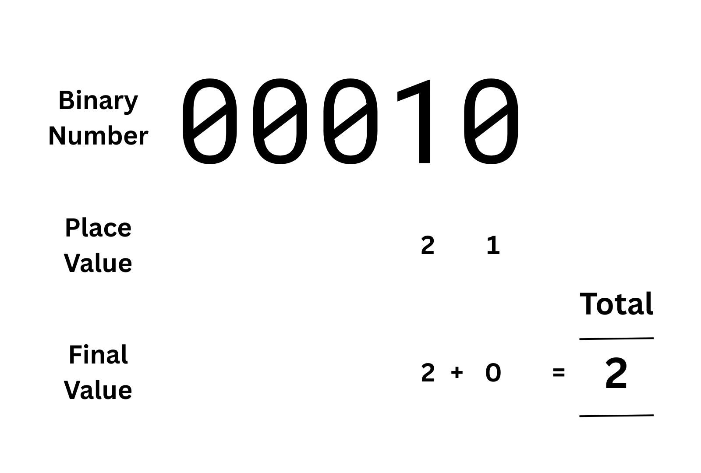

So the value of a binary digit is determined by its position in the binary number. The first digit has a place value of `1`, and the second digit has a place value of `2`.  

How do we represent the number `3`?

`3` is represented by turning on the right-most digit (with a place value of `1`) and the second digit from the right (with a place value of `2`). The values of these digits are added together to get `3`.  

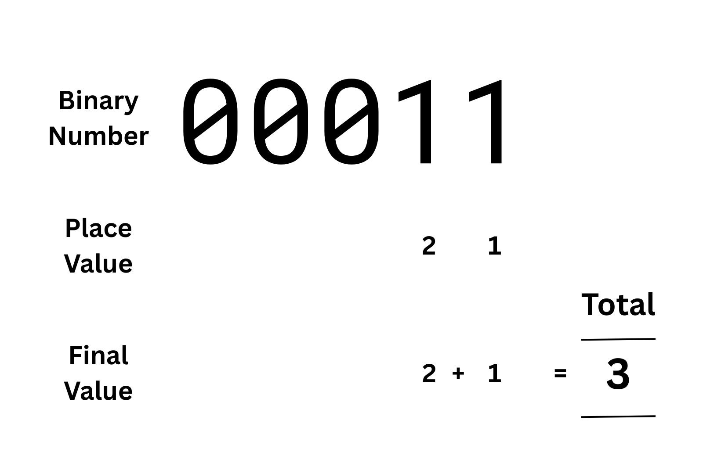

To determine the value of a binary number with more than one `1` bit, we can simply add the place values of those `1` bits together.  

But how do we know what the place values are without being told. The first place value (from the right) is `1`. The second is `2`.

The place value of the third digit is `4`, so to represent `4` in binary we can set all the other columns to zero and set the third digit to `1`.  

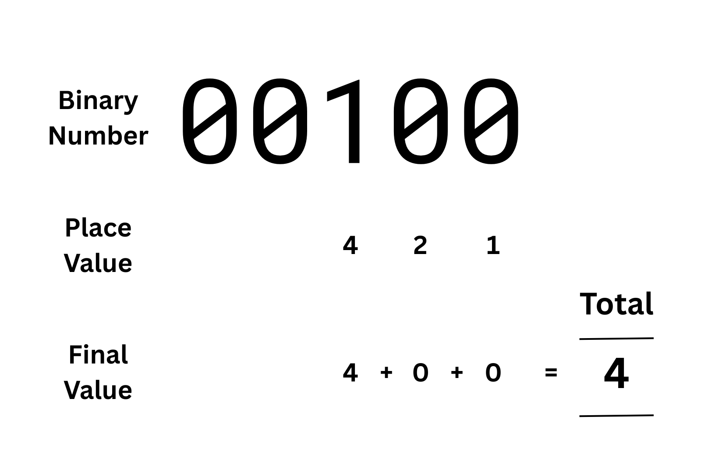

Note that this is similar to "carrying" a number in decimal mathematics. We incrememnt a new digit and set all the ones to its right back to zero.  

To get `5` we keep the third digit as one and also change the first digit to one. Four plus one equals five, so the final value equals five.  

Six is a combination of ones in the places valued `4` and `2`, because `4 + 2 = 6`.  

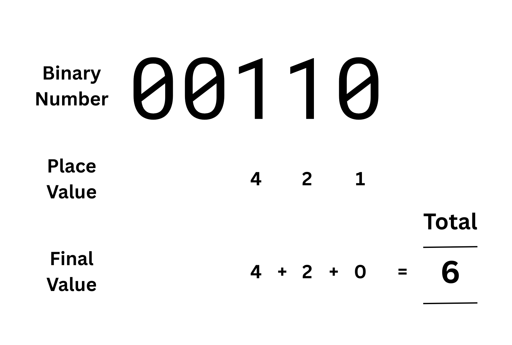

Seven is all three of the first three bits set to one: `00111`.  These are multiplied by their place values and added together to equal `7`.  

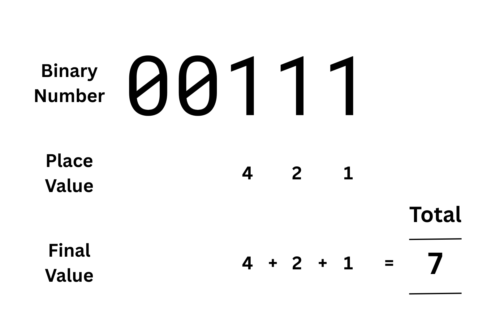

If we want to represent a higher number, we need to use an additional bit. Once more, we would carry the three rightmost bits of `00111`, flipping them to zero, and setting the fourth bit to one.  

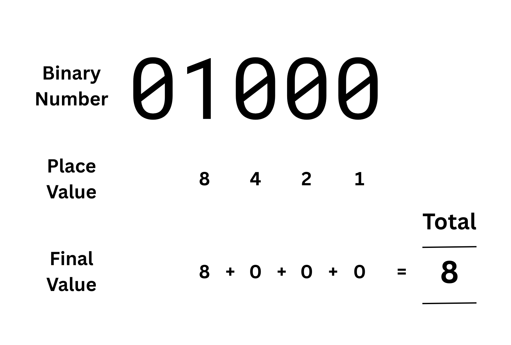

So it takes three digits to represent eight values, from `0` to `7`. In unary, this would take seven digits, or two hands.  

Using binary, how many values can we represent in five digits?  

You may have notices that the place value of each position doubles the further we move to the left. From this we can extrapolate the place value of the remaining position. The fifth digit has a place value of `16`.  

  

In binary, we can represent 32 values with five digits (from zero to thirty one). A binary number can represent as many values as `2^n` where n is the number of bits.  

How does this work? As we have already stated, the position of each digit affects the value of the number that it represents.  

The bit in each place is multiplied by the place value for that position, and then these products are added together to give the final value. In this way we can represent any integer by combining enough bits.  

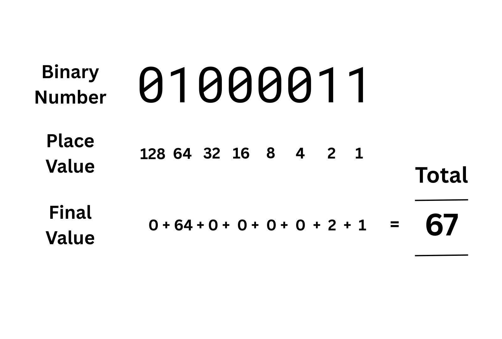

Bits can be represented in a computer with electricity. For example, a zero might be represented by zero voltage, and one represented by 5 volts.  

Binary can then be stored in the charges of transistors. These are like switches than can be turned on or off by capturing or discharging electricity. A transistor storing no electricity equals zero. A transistor storing electricity equals one. Modern computers contain millions of transistors, allowing them to work with a lot of large binary values.  

Binary can also be transmitted through connections like wires in the form of pulses of electricity as well.  

Binary is used in computers because it translates so well to the world of electronics.   

Humans do not use binary in written mathematics. They use the decimal number system. "Dec" implies 10 and the decimal number system has 10 digits, `0` through `9`. But it turns out that the decimal system and binary have a lot in common.  

### The Decimal Number System (Base-10)

Much as computer languages work in the same way as human languages, the computer's number of system of binary (base-2) essentially works the same way as the numerical system most humans use: the decimal number system (base-10).  These number systems are not arbitrary. They have mathematical relationships that mean you can translate numbers between them.  

Decimal is the written number system most of us are familiar with, with ten numeric symbols ranging from `0` to `9`. Like binary, decimal is a positional system. The position of the digit affects its total value.  

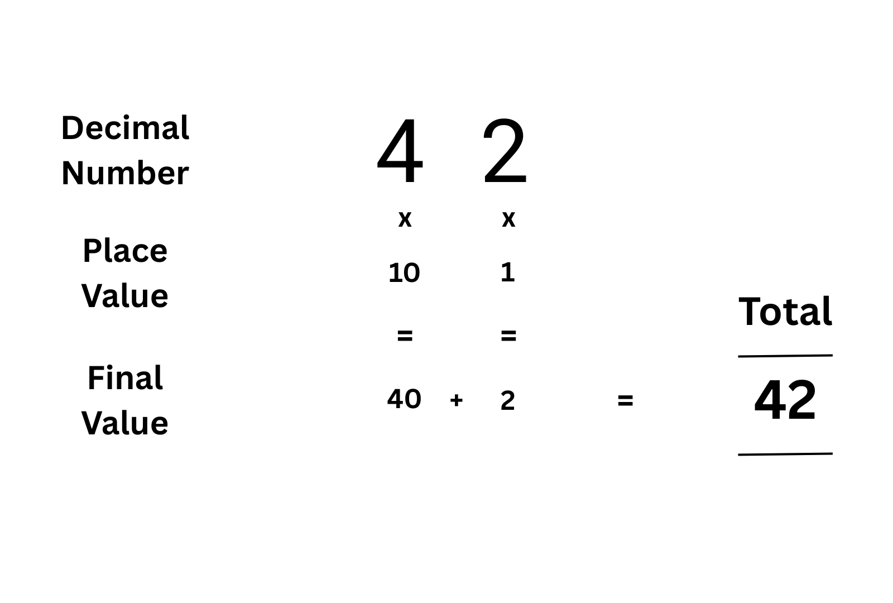

You may rmember learning about this in your childhood. In the number `42`, the rightmost digit, `2` has a value of `2`, but the second digit to the right, the `4`, has a value of `4 * 10`. This is because, in elementary school mathematics, the first column on the right is a "ones" column and the next column to the left is the "tens" column.  

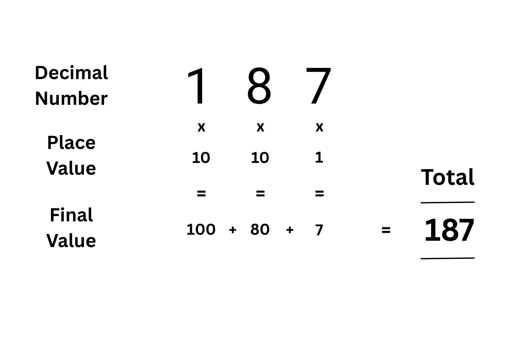

Similarly, in the number `187`, the `1` had a value of `100`, because it is in the third place from the right, the "hundreds" column. `8` is in the "tens" column so it has a value of `8 * 10 = 80`. `7` is in the "ones" column so its value is `7 * 1 = 7`. We get the final value by additing these products together, i.e. `(1 * 100) + (8 * 10) + (7 * 1) = 100 + 80 + 7 = 187`.  

What is the pattern here? In each column from right to left we are multiplying the digit in that place by ten to the power of its place from the right (starting at `10^0` with the first digit).  

The rightmost digit is multiplied by `10^0`, or `1`. The next digit to the left is multiplied by `10^1`, or `10`. The next digit to the left of that is multiplied by `10^2`, or `100`. We multiply by 10 because we are using base-10, which has a total of ten digits (`0` through `9`).  

So how does this help us understand binary?  

### How to Calculate a Binary Number

Binary works exactly the same. But because we only have two digits, we multiply the bit in each position by `2` to the power of how many positions it is from the rightmost digit.  

This is one of the reasons why powers of `2` come up so much in computer science: hardware specifications, computer memory, hard disk space, and even programming errors. For example, the game Pac Man had a glitch on level 256 because the designers used a single byte (i.e. an 8-bit number) to store the level number. When it incremented past 255 it cycled back to zero, causing numerous logical errors throughout the game.  

The more bits you have, the greater range of values you can represent. `n` bits can represent `2^n` values. Modern computers often use 32-bits (four bytes) to represent a range of about 4 billion integers (or 2 billion if you include negative integers). With 64-bit words (eight bytes) we can represent `2^64` values, which is quite a large number.  

For the sake of simplicity, we will look at 8-bit words.  

As with decimal numbers, binary is a positional number system. The actual value of a digit is based on its place in the overall number. This is called the place value, or sometimes the **positional value**. The digit's value (i.e. zero or one) is multiplied by its place value to give a final value for that digit, as we have discussed.  

The place value of a digit is based on its position from the rightmost digit (starting with zero). In decimal, the place value `10^n`, where n is the place of the digit starting with zero for the rightmost digit. We multiply by `10` because this is the base number system being used, i.e. there are 10 digits in the decimal system.  

In binary, the place value is `2` raised to the power of the position. So the place value of the rightmost digit is `2^0`, which is `1`. The second digit's place value is `2^1`, which is `2`. The second digit is multiplied by `2^2`, or `4`. The third digit is multiplied by `2^3`, or `8`, etc.  

Any given bit's place value is therefore `2^(n-1)` where n is the place of the digit, starting with `0` at the rightmost digit.  

In binary, this is nice and simple, because unlike in decimal we don't need to multiply the value of an individual digit by the place value. A one represents the place value, zero represents zero, and the represented place values are added together for the final total.  

It is theoretically possible to represent any base number system using these same mathematics.  

For example, the hexadecimal system (base-16) is used to represent things like memory and colour values with digits ranging from `0`to `9` and then `A` through `F`. The ocstal system (base-8) is used in Linux to represent file permissions with digits ranging from `0` to `7`.  

The next chapter will look at how binary numbers can be used to represent other data, in addition to numbers.  
